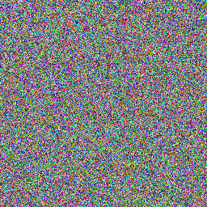

# ks-bin-fuzzer

Kaitai Struct compiler to produce format specific binary fuzzer

## Running the compiler

1. Run the `run.sh` script provided in the root directory of this repository and provide the Kaitai Struct file to the script. For example: `./run.sh definitions/animal.ksy`

2. The generated fuzzer is located in the `build` directory.

## Kaitai Struct DSL extensions

| Key                       | Description                                                                                                                                                                                         |
| ------------------------- | --------------------------------------------------------------------------------------------------------------------------------------------------------------------------------------------------- |
| `-fz-process-<algorithm>` | Populate the field with the result of the algorithm (the algorithm will produce bytes type), applied to the specified field. See [here](#algorithms-available) for the list of supported algorithm. |
| `-fz-attr-len`            | Mark this field as a length field of another field. The value of this field will be automatically populated by the byte length of said field.                                                       |
| `-fz-order`               | Produce an output in a specific order. The value is populated and removed from the list when a new instance of a type that contains a field with this key is initialised.                           |
| `-fz-random-order`        | Produce an output in a random order. The value is populated and removed from the list when a new instance of a type that contains a field with this key is initialised.                             |
| `-fz-range-min`           | Minimum value (inclusive) that can be generated. Only works for numbers.                                                                                                                            |
| `-fz-range-max`           | Maximum value (inclusive) that can be generated. Only works for numbers.                                                                                                                            |
| `-fz-repeat-min`          | Repeat for a minimum (inclusive) number of time. Only valid for `repeat: eos`.                                                                                                                      |
| `-fz-repeat-max`          | Repeat for a maximum (inclusive) number of time. Only valid for `repeat: eos`.                                                                                                                      |
| `-fz-size-min`            | Minimum size (inclusive) of the field that can be generated. Only works for strings or bytes.                                                                                                       |
| `-fz-size-max`            | Maximum size (inclusive) of the field that can be generated. Only works for strings or bytes.                                                                                                       |
| `-fz-choice`              | Randomly pick an option from the list of choices available.                                                                                                                                         |
`-fz-static`
`-fz-increment`
`-fz-increment-step`
### Algorithms Available

`crc32`,
`md5`,
`sha1`,
`sha224`,
`sha256`,
`sha384`,
`sha512`,
`sha3-224`,
`sha3-256`,
`sha3-384`,
`sha3-512`

## Running tests

From the root directory of this repository, run:

```
pytest tests
```

### Code coverage

```sh
coverage run --branch --source=src -m pytest tests && coverage html
```
